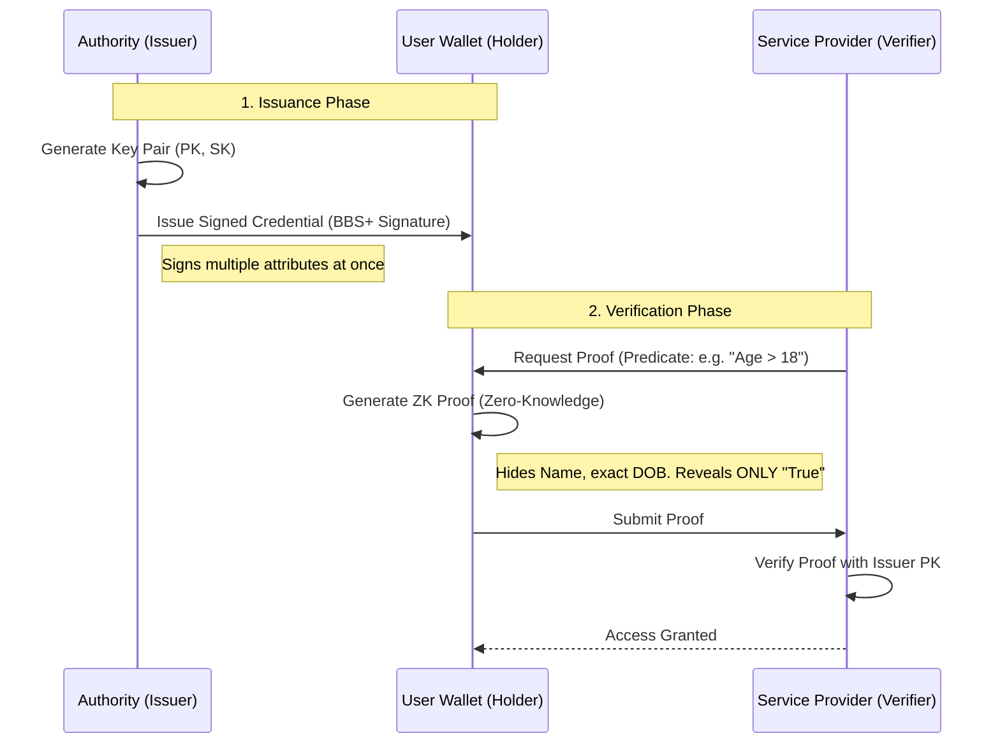

# PrivaSeal - Universal ZKP Attribute Verification Platform

A Zero-Knowledge Proof (ZKP) credential system allowing selective disclosure of attributes without revealing full identity. Built with Next.js (Frontend) and FastAPI (Backend).

## 🛡️ Project Overview

**PrivaSeal** is a privacy-preserving attribute verification system designed to empower users with full control over their personal data. By leveraging **Zero-Knowledge Proofs (ZKP)** and **BBS+ Signatures**, PrivaSeal allows individuals to prove specific claims (e.g., "Age > 21", "Government Certified Resident") without exposing their full identity or exact underlying data.

Traditional digital identity exposes excessive data and creates correlation risks. PrivaSeal solves this by decoupling the *Proof* from the *Data*, offering:
- **Selective Disclosure**: Reveal only specific attributes (e.g. proof of age without showing birthdate).
- **Unlinkability**: Every proof uses a unique nonce, preventing correlation across different services.
- **Multi-Verifier Functionality**: Different verifiers can request different cryptographic proofs from the exact same underlying credential.

## 🏗️ Architecture & Tech Stack

- **Frontend**: Next.js 14, TailwindCSS, Zustand, Shadcn UI, Next-PWA, Firebase Auth
- **Backend (Python)**: FastAPI, Uvicorn, SQLAlchemy, Pytest
- **Backend (Node)**: Express, Mongoose, Firebase Admin SDK
- **Database**: SQLite (SQLAlchemy) internally for Python, Dexie.js (IndexedDB) for secure client browser storage. Firebase Firestore/NoSQL.
- **Crypto Engine**: Simulation of BBS+ signatures (BLS12-381) capable of multi-message signing and selective disclosure ZKP proofs.



## 🚀 Key Modules

1. **Issuer Portal**: Create custom attribute sets and generate signed credentials securely. Distribute them instantly via secure QR payloads.
2. **User Wallet (PWA)**: Self-sovereign offline storage of credentials. On-the-fly ZK proof generation and interactive privacy scanner.
3. **Verifier Dashboard**: Define custom requirement predicates and process cryptographic verifications instantly with privacy-compliant auditing.

## ⚙️ Prerequisites

- Node.js 18+  
- Python 3.10+
- Firebase Web/Server Keys (For Email/Google/Phone Auth, Firestore Database, Storage)

## 🛠️ Setup & Run

### Firebase Setup
Before running the application, set up your Firebase project as detailed in the [`FIREBASE_SETUP.md`](./FIREBASE_SETUP.md) guide. Make sure to specify your configuration in `frontend/.env.local`.

### 1. Unified Setup (Recommended)
You can utilize the predefined scripts to bootstrap the application:
```bash
# 1. Install Backend Dependencies
# Creates and uses a Python venv internally
.\install_backend.bat

# 2. Run the application
# Starts both the Backend (port 8000) and Frontend (port 3000) concurrently
npm run dev
# Alternatively, you can run the batch script:
.\start_server.bat
```

### 2. Manual Setup

**Backend (Python):**
```bash
cd backend
python -m venv venv
.\venv\Scripts\activate   # Windows
# source venv/bin/activate  # Mac/Linux
pip install -r requirements.txt
uvicorn app.main:app --reload --port 8000
```

**Frontend:**
```bash
cd frontend
npm install
npm run dev
```

## 🌐 Usage Guidelines

1. Launch your application at [http://localhost:3000](http://localhost:3000).
2. Register and navigate to the **Issuer Portal** to define and establish a verifiable credential.
3. Claim the credentials safely inside your **Wallet**.
4. Access the **Verifier** dashboard to form boolean predicates on user attributes to check `true/false` viability without querying the explicit property values.

## 🔒 Security Abstract

- **No Server Breaches**: Credentials reside securely *only* on the user's localized device database (IndexedDB). They are never saved passively on a centralized database.
- **Cryptographic Binds**: Replay attacks are mitigated since ZKP claims require unique runtime session nonces.
- **No Identity Linkages**: The user can safely prove their identity to hundreds of apps using different session credentials without an overlapping trace being generated.

---

*PrivaSeal – Bringing sovereignty and robust, verified privacy directly back to the active user.*
